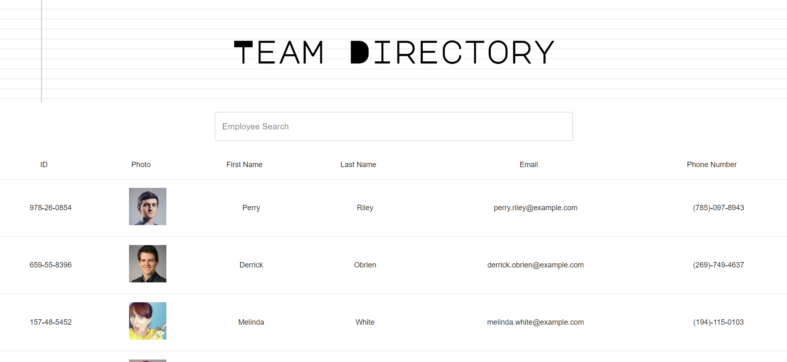

# Team Directory 

[](https://choosealicense.com/licenses/mit/)




#### Deployed Application: [Team Directory](https://a-thread.github.io/react-team-directory/)

    

## Description

**Team Directory** is an application built in Typescript and powered by React that enables the user to view, search and sort their employees by id, first name, last name, cell number and email. The directory also shows a photo of each employee so that employees can familiarize themselves with the team.

---

#### Table of Contents

* [Description](#description)
* [User Story](#user)
* [Demo](#demo)
* [Technologies Used](#technologies)
* [License](#license)
* [Contributing](#contributing)
* [Questions](#questions)

---

### User Story

 ```
 As a user, I want to be able to view my entire employee directory at once so that I have quick access to their information.
 ```

### Demo 


Check it out for yourself: [Team Directory](https://a-thread.github.io/react-team-directory/)

### Technologies Used

* React
* Typescript
* Material-UI
* Express
* Axios
* WebPack
* Google Fonts
* Font Awesome
* PostMan

### Contributing

If you'd like to contribute to this application, feel free to submit a pull request.

#### License

This project is licensed under MIT. 

#### Questions

    

If you have any questions, please [email me.](mailto:aiden.threadgoode@gmail.com)

If you'd like to see more of my work, feel free to check out [my github!](https://github.com/a-thread)

*© 2020 Aiden Threadgoode*
